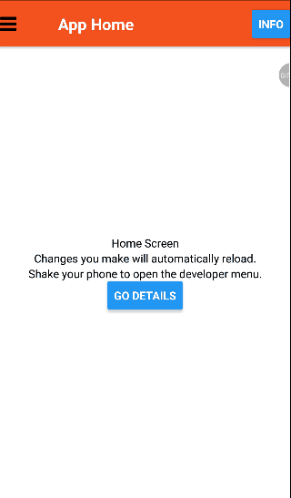

React Native Quick Start Using [Expo](https://expo.io/)
=======================================================

### Summary

This is a guide for people starting looking to do Mobile App Development using React Native.
At the end of this guide the expected result is an app with the following functionality

1. Header with menu that shows the slider/drawer
2. Button displaying alert box
3. Display full text search result of internal database

Below is the expected output.




### Prerequisites:

1. [nodejs/npm](https://nodejs.org/en/)
2. expo mobile app [ios](https://itunes.apple.com/app/apple-store/id982107779) / [android](https://play.google.com/store/apps/details?id=host.exp.exponent)
3. Optional [yarn](https://yarnpkg.com/en/docs/install)

### Steps

#### Default App

1. Install create-react-native-app
    - `npm i -g create-react-native-app`
2. Create initial mobile app
    - `create-react-native-app [app name]`
3. Run the app via yarn
    - `cd [app name]`
    - `yarn start`
4. Run the app via npm
    - `cd [app name]`
    - `npm start`
5. Open expo mobile app and scan QR code

#### React Navigation

1. Add react-navigation via yarn or npm
    - `yarn add react-navigation`
    - `npm i react-navigation`

2. Use a StackNavigator as [Home](https://reactnavigation.org/docs/hello-react-navigation.html) Screen
    - import StackNavigator
        ```
        import { StackNavigator } from 'react-navigation';
        ```

    - create HomeScreen React.Component replacing the `default class App`
        ```
        class HomeScreen extends React.Component {
            render() {
                return (
                <View style={styles.container}>
                    <Text>Home Screen</Text>
                    <Text>Changes you make will automatically reload.</Text>
                    <Text>Shake your phone to open the developer menu.</Text>
                </View>
                );
            }
        }
        ```
    - export as default the StackNavigator
        ```
        export default StackNavigator({
            Home: {
                screen: HomeScreen,
            },
        });
        ```
    - create a `default class App`
        ```
        const RootStack =StackNavigator({
            Home: {
                screen: HomeScreen,
            },
        });

        export default class App extends React.Component{
            render(){
                return <RootStack />
            }
        }
        ```
3. Utilize multiple screens and [navigate](https://reactnavigation.org/docs/navigating.html) them
    - import a button `import { Button, StyleSheet, Text, View } from 'react-native';`
    - add a Details Button
        ```
        class HomeScreen extends React.Component{
            render(){
                return (
                <View style={styles.container}>
                    <Text>Home Screen</Text>
                    <Text>Changes you make will automatically reload.</Text>
                    <Text>Shake your phone to open the developer menu.</Text>
                    <Button 
                    title = "Go Details"
                    onPress={()=> this.props.navigation.navigate('Details')}
                    />
                </View>
                );
            }
        }
        ```
    - create Details screen with Go back Button
        ```
        class DetailsScreen extends React.Component{
            render(){
                return(
                <View style={styles.container}>
                    <Text> Details Screen</Text>
                    <Button 
                    title = "Go Back"
                    onPress={()=> this.props.navigation.goBack()}
                    />
                </View>
                );
            }
        }
        ```
    - add a title in header bar
        ```
        class HomeScreen extends React.Component {
            static navigationOptions = {
                title: 'Home',
            };

            /* render function, etc */
        }

        class DetailsScreen extends React.Component {
            static navigationOptions = {
                title: 'Details',
            };

            /* render function, etc */
        }
        ```
    - setting styles applicable to screens in StackNavigator
        ```
        const RootStack = StackNavigator(
            {
                Home: {
                screen: HomeScreen,
                },
                Details: {
                screen: DetailsScreen
                },
            },
            {
                initialRouteName: 'Home',
                navigationOptions: {
                headerStyle: {
                    backgroundColor: '#f4511e',
                },
                headerTintColor: '#fff',
                headerTitleStyle: {
                    fontWeight: 'bold',
                },
                }
            }
        );
        ```
    - add a button in the header bar
        ```
        class HomeScreen extends React.Component {
            static navigationOptions = {
                title: 'Home',
                headerRight: (
                <Button
                    onPress={() => alert('This is a button!')}
                    title="Info"
                    // color="#fff"
                />
                ),
            };
            /* render function, etc */
        }
        ```
4. Add a [Drawer/Slider](https://reactnavigation.org/docs/drawer-based-navigation.html) with multiple screens
    - add react-native-elements 
        ```
        yarn add react-native-elements@1.0.0-beta3
        ```
    - import Icons and DrawerNavigator
        ```
        import { StackNavigator, DrawerNavigator, DrawerItems, SafeAreaView } from 'react-navigation';
        import { Icon } from 'react-native-elements'
        ```
    - Create StackNavigators for each Path/Screen that will be defined in the DrawerNavigator
        ```
        const DetailsStack = StackNavigator(
        {
            Details: {
            screen: DetailsScreen,
            navigationOptions: ({ navigation }) => ({
                title: 'App Details',
                headerLeft: (
                <Icon
                    name="bars"
                    // size={30}
                    type="font-awesome"
                    // iconStyle={{ paddingLeft: 10 }}
                    onPress={() => navigation.navigate('DrawerOpen')}
                />
                ),
                drawerLabel: 'Details',
                drawerIcon: ({ tintColor }) => (
                <Icon
                    name="users"
                    // size={30}
                    // iconStyle={{
                    //   width: 30,
                    //   height: 30
                    // }}
                    type="font-awesome"
                    color={tintColor}
                />
                ),
            }),
            },
        },
        {
            initialRouteName: 'Details',
            navigationOptions: {
            headerStyle: {
                backgroundColor: '#f4511e',
            },
            headerTintColor: '#fff',
            headerTitleStyle: {
                fontWeight: 'bold',
            },
            }
        }
        );
        ```
    - Create an instance of DrawerNavigator replacing the old RootStack
        ```
        const CustomDrawerContentComponent = props => (
        <View style={{ flex: 1, 
            // backgroundColor: '#43484d' 
            backgroundColor: '#007AFF' 
        }}>
            <View
            // style={{ marginTop: 40, justifyContent: 'center', alignItems: 'center' }}
            >
            <Icon
                name="user-md"
                // style={{ width: SCREEN_WIDTH * 0.57 }}
                type="font-awesome"
            />
            </View>
            <View 
            // style={{marginLeft: 10}}
            >
            <DrawerItems {...props} />
            </View>
        </View>
        );

        const RootStack = DrawerNavigator(
        {
            Home: {
            path: '/home',
            screen: HomeStack,
            },
            Details: {
            path: '/details',
            screen: DetailsStack,
            },
        },
        {
            initialRouteName: 'Home',
            contentOptions: {
            activeTintColor: '#548ff7',
            // activeTintColor: '#007AFF',
            activeBackgroundColor: 'transparent',
            inactiveTintColor: '#ffffff',
            inactiveBackgroundColor: 'transparent',
            // labelStyle: {
            //   fontSize: 15,
            //   marginLeft: 0,
            // },
            },
            // drawerWidth: SCREEN_WIDTH * 0.8,
            contentComponent: CustomDrawerContentComponent,
            drawerOpenRoute: 'DrawerOpen',
            drawerCloseRoute: 'DrawerClose',
            drawerToggleRoute: 'DrawerToggle',
        }
        );
        ```
5. Utilizing sqlite database with search
    - import expo SQLite and create/open a database
        ```
        import Expo, { SQLite } from 'expo';
        const db = SQLite.openDatabase('db.db');
        ```
    - in the main component initialize data within [componentDidMount](https://reactjs.org/docs/react-component.html)
        ```
        componentDidMount() {
          db.transaction(tx => {
            let queries = [
              "DROP TABLE IF EXISTS docs",
              "CREATE VIRTUAL TABLE docs USING fts4()",
              "INSERT INTO docs(docid, content) VALUES(1, 'a database is a software system')",
              "INSERT INTO docs(docid, content) VALUES(2, 'sqlite is a software system')",
              "INSERT INTO docs(docid, content) VALUES(3, 'sqlite is a database')"
            ]
            queries.forEach((q,i)=>{
              console.log('executing', q);
              tx.executeSql(q,[],(_, { res })=>{console.log('suc', _, res);},(_, { err })=>{console.log('error', _, err);});
            });
          });
        }
        ```
    - initialize a results state create a method for search query
        ```
        constructor(props) {
          super(props);
          this.state = {
            query: null,
            results: []
          };
        }
        // other codes
        ...

        // experimental class fields syntax in order not to have to call bind
        // https://reactjs.org/docs/handling-events.html
        pressItem = (searchQuery) => {
          console.log('press item query', searchQuery);
          db.transaction(
            tx => {
              tx.executeSql("SELECT COUNT(*) FROM docs",[], (_, { rows }) =>
                console.log('count', JSON.stringify(rows))
              );
              tx.executeSql("SELECT docid, content FROM docs WHERE docs MATCH ?",[searchQuery], (_, { rows }) =>{
                console.log('fts query', JSON.stringify(rows));
                this.setState({results: rows._array});
              }
              );
            },);
        };

        ```
    - import Input component and use inputted text as the query
        ```
        import { Icon, Input, List, ListItem } from 'react-native-elements';
        import { Button, StyleSheet, Text, View, ScrollView } from 'react-native';
        <ScrollView>
        ...
        <Input
          // style={{
          //   flex: 1,
          //   padding: 5,
          //   height: 40,
          //   borderColor: 'gray',
          //   borderWidth: 1,
          // }}
          maxLength = {40}
          placeholder="what do you need to do?"
          value={this.state.query}
          onChangeText={(text) => {
            console.log('text change', text);
            this.setState({query: text})
            if(text.length>=3){
              this.pressItem(text);
            }
          }}
          onSubmitEditing={() => {
            this.pressItem(this.state.query);
            // this.setState({ text: null });
          }}
        />
        <Button
        title = "Query"
        onPress={()=> this.pressItem(this.state.query)}
        />
        <List containerStyle={{marginBottom: 20}}>
          {
            results.map((l, i) => (
              <ListItem
                // roundAvatar
                // avatar={{uri:l.avatar_url}}
                key={l.docid}
                title={l.content}
              />
            ))
          }
        </List>
        </ScrollView>
        ```
6. Modularizing your code for readability and maintenability
    - within the `[app name]` directory create `app` directory and related files
        ```
        [app name]
        ├── App.js
        ├── app
            ├── containers
            │   ├── Details.js
            │   └── Home.js
            ├── lib
            │   └── DB.js
            └── styles.js
        

        ```
    - Create a DB [Singleton](https://en.wikipedia.org/wiki/Singleton_pattern) in `[app name]/app/lib/DB.js`
        ```
        // app/containers/Home.js
        import { SQLite } from 'expo';
        import { Platform } from 'react-native';


        class DB {
            constructor(sqliteModule=SQLite, name='db.db') {
                if (!DB._instance) {
                console.log(`Opening Database for ${Platform.OS}, ${sqliteModule}, ${name}`);
                // https://github.com/andpor/react-native-sqlite-storage/issues/184
                this.conn = sqliteModule.openDatabase(name);
                this.conn.transaction((tx)=>{
                    tx.executeSql("SELECT SQLITE_VERSION() AS version", [], 
                    (_, rs) => {
                        console.log('Got version result: ' + rs.rows.item(0).version);
                    },
                    (_, error) => {
                    console.log('db test error:', error)
                    });
                }, this.errorCB, this.successCB);
                DB._instance = this;
                }
                return DB._instance
            }
            errorCB(err) {
                console.log("SQL Error: " + err);
                throw new Error(`DB transaction error ${err}`);
            }

            successCB() {
                console.log("SQL executed fine");
            }

            query(q,params=[],cb,eb){
                this.conn.transaction(
                (tx)=>{
                    tx.executeSql(q,params,cb,eb)
                },
                this.errorCB,
                this.successCB,
                )
            }
        }
        ```
    - Remove `Homestack` and `HomeScreen` code `App.js` and put them in the file `[app name]/app/containers/Home.js`. Import the `HomeStack` component in the main file `App.js`
        ```
        // App.js
        import HomeStack from './app/containers/Home'

        // app/containers/Home.js
        import React from 'react'
        import { StackNavigator } from 'react-navigation'
        import { Button, Text, View } from 'react-native';
        import { Icon } from 'react-native-elements';
        import { appStyle } from '../styles'
        
        class HomeScreen extends React.Component {
            ....
        }
        const HomeStack = StackNavigator({
          Home: {
          screen: HomeScreen,
          ...
          }
        })

        export default HomeStack;
        ```
    - Remove `DetailsStack` and `DetailsScreen` code in `App.js` and put them in the file `[app name]/app/containers/Details.js`. Import the `DB` class from `../lib/DB` and instantiate.  Import the `DetailsStack` component in the main file `App.js` 
        ```
        // App.js
        import DetailsStack from './app/containers/Details'

        // app/containers/Details.js
        import React from 'react'
        import { Button, Text, View, ScrollView } from 'react-native';
        import { StackNavigator } from 'react-navigation'
        import { Icon, Input, List, ListItem } from 'react-native-elements';
        import { appStyle } from '../styles'
        import DB from '../lib/DB'
        
        const db =  new DB()

        class DetailsScreen extends React.Component{
            constructor(props) {
                ...
            }
        }

        const DetailsStack = StackNavigator(
        {
            Details: {
            screen: DetailsScreen,
                ...
            }
        }

        export default DetailsStack
        ```
    - Remove `styles` `Stylesheet` component in App.js and rename styles as `appstyles` put the code in the file `[app name]/app/styles.js`. Import appstyles `stylesheet` component in the main file `App.js`.
        ```
        // app/styles.js
        import { StyleSheet } from 'react-native';
        
        export const appStyle = StyleSheet.create({
          container: {
            flex: 1,
            backgroundColor: '#fff',
            alignItems: 'center',
            justifyContent: 'center',
          },
        });
        ```
